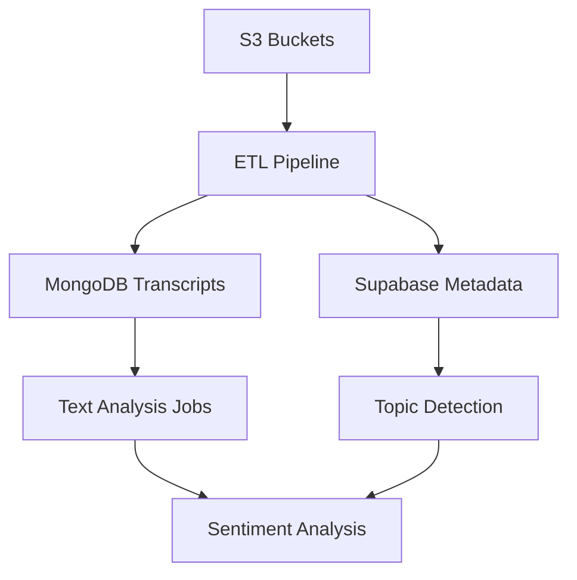

# Database Architecture: Supabase vs MongoDB

**Last Updated**: June 25, 2025  
**Purpose**: Document the ACTUAL dual-database architecture and current AS-IS state
**Context**: Post-MongoDB metadata migration - Episode metadata now in MongoDB

## 🎯 **CURRENT AS-IS STATE (June 25 2025)**

### 🆕 Major Update: MongoDB Episode Metadata Migration
- **NEW**: MongoDB `episode_metadata` collection with 1,236 episodes
- **CHANGE**: API now reads episode metadata from MongoDB instead of Supabase
- **REASON**: Supabase had 90% placeholder data; real metadata exists in S3/MongoDB

**✅ ACTIVE Infrastructure:**
- **Embeddings:** 1,171 episodes with 384D vectors in Supabase (`sentence-transformers/all-MiniLM-L6-v2`)
- **Search:** Hybrid MongoDB text search (primary) + pgvector fallback
- **Performance:** MongoDB outperforming vector search (real vs synthetic excerpts)
- **Storage:** S3 has 818,814 segment embeddings (~600MB)

**⚠️  Documentation Corrections:**
- **Was documented:** 1536D OpenAI embeddings, vector-first search
- **Actually implemented:** 384D sentence-transformers, text-first search

--- 

## Overview

PodInsight uses a **hybrid database architecture** with two complementary systems:

- **Supabase (PostgreSQL)**: Structured, relational data for analytics and metadata
- **MongoDB**: Unstructured text data for search and content analysis

This separation optimizes for both analytical queries and full-text search performance.

---

## Supabase (PostgreSQL) - Structured Analytics Data

### What It Stores

#### 1. **Core Metadata**
```sql
-- Podcasts table
podcasts (
  id UUID PRIMARY KEY,
  title VARCHAR,
  description TEXT,
  feed_url VARCHAR,
  created_at TIMESTAMP
)

-- Episodes table  
episodes (
  id UUID PRIMARY KEY,
  podcast_id UUID REFERENCES podcasts(id),
  title VARCHAR,
  published_at TIMESTAMP,
  duration INTEGER,
  episode_url VARCHAR
)
```

#### 2. **Topic Analytics**
```sql
-- Topic mentions with weekly aggregation
topic_mentions (
  id SERIAL PRIMARY KEY,
  episode_id UUID REFERENCES episodes(id),
  topic_name VARCHAR,
  mention_count INTEGER,
  mention_date DATE,
  created_at TIMESTAMP
)

-- Topic velocity calculations
topic_velocity (
  topic_name VARCHAR,
  week_start DATE,
  total_mentions INTEGER,
  episode_count INTEGER,
  growth_rate DECIMAL
)
```

#### 3. **Entity Recognition**
```sql
-- People, companies, funds mentioned in episodes
entities (
  id SERIAL PRIMARY KEY,
  name VARCHAR,
  type VARCHAR, -- 'person', 'company', 'fund'
  description TEXT,
  metadata JSONB
)

-- Entity mentions in episodes
entity_mentions (
  id SERIAL PRIMARY KEY,
  entity_id INTEGER REFERENCES entities(id),
  episode_id UUID REFERENCES episodes(id),
  mention_count INTEGER,
  context TEXT,
  confidence DECIMAL
)
```

#### 4. **Signals & Correlations**
```sql
-- Topic correlation signals
topic_signals (
  id SERIAL PRIMARY KEY,
  signal_type VARCHAR, -- 'correlation', 'trend', 'anomaly'
  topic_name VARCHAR,
  signal_strength DECIMAL,
  description TEXT,
  calculated_at TIMESTAMP
)
```

#### 5. **User & Analytics Data**
```sql
-- Future: User management, saved searches, preferences
users (
  id UUID PRIMARY KEY,
  email VARCHAR,
  created_at TIMESTAMP
)

-- Future: Usage analytics
search_queries (
  id SERIAL PRIMARY KEY,
  user_id UUID,
  query TEXT,
  results_count INTEGER,
  clicked_results JSONB,
  created_at TIMESTAMP
)
```

### Why Supabase for This Data

✅ **Structured Queries**: Complex JOINs across podcasts, episodes, topics  
✅ **Analytics**: Aggregations, time-series calculations, growth rates  
✅ **Real-time**: Supabase real-time subscriptions for live updates  
✅ **Admin Interface**: Built-in admin panel for data management  
✅ **API Generation**: Auto-generated REST/GraphQL APIs  
✅ **Performance**: Indexed queries, query optimization  

---

## MongoDB - Unstructured Content Data

### What It Stores

#### 1. **Full Transcripts**
```javascript
// MongoDB document structure
{
  _id: ObjectId("..."),
  episode_id: "3a50ef5b-6965-4ae5-a062-2841f83ca24b", // Links to Supabase
  podcast_name: "This Week in Startups",
  episode_title: "Tech's Super Bowl, Huge Earnings Week",
  published_at: ISODate("2025-02-11T00:00:00Z"),
  
  // Full transcript for search
  full_text: "Complete episode transcript combined from all segments...",
  word_count: 12373,
  
  // Time-coded segments for playback
  segments: [
    {
      text: "Lon is back, Lon Harris is back...",
      speaker: "SPEAKER_01",
      start_time: 0.0,
      end_time: 5.2
    },
    // ... hundreds more segments
  ],
  
  // Topics mentioned (denormalized from Supabase)
  topics: ["AI Agents", "B2B SaaS"],
  
  // Migration metadata
  migrated_at: ISODate("2025-06-19T23:45:00Z"),
  source_s3_path: "pod-insights-stage/thisweekin/..."
}

// NEW: episode_transcripts collection
{
  _id: ObjectId("..."),
  episode_id: "3a50ef5b-6965-4ae5-a062-2841f83ca24b",
  podcast_name: "This Week in Startups",
  full_text: "Complete transcript...",
  segments: [...],
  topics: ["AI Agents", "B2B SaaS"]
}

// NEW: transcript_chunks_768d collection (Modal.com vector search)
{
  _id: ObjectId("..."),
  episode_id: "3a50ef5b-6965-4ae5-a062-2841f83ca24b",
  chunk_text: "Sequoia invested $200M in OpenAI...",
  embedding_768d: [768 float values],
  start_time: 1420.5,
  end_time: 1450.2
}

// NEW: episode_metadata collection (June 25, 2025)
{
  _id: ObjectId("..."),
  guid: "0e983347-7815-4b62-87a6-84d988a772b7",
  raw_entry_original_feed: {
    episode_title: "Chris Dixon: Stablecoins, Startups, and the Crypto Stack",
    podcast_title: "a16z Podcast",
    published_date_iso: "2025-06-09T10:00:00",
    feed_url: "https://feeds.simplecast.com/JGE3yC0V"
  },
  guests: [
    {"name": "Chris Dixon", "role": "guest"}
  ],
  segment_count: 411,
  _import_timestamp: "2025-06-25T15:37:06.123Z",
  _s3_path: "s3://pod-insights-stage/a16z-podcast/..."
}
```

#### 2. **Current Embeddings** (✅ ACTIVE - Sprint 1)
**Location:** Supabase `episodes.embedding` field
**Format:** `vector(384)` - pgvector format
**Model:** `sentence-transformers/all-MiniLM-L6-v2`
**Coverage:** 1,171 episodes (100%)

**S3 Segment Storage:**
```
s3://pod-insights-stage/{podcast}/{episode}/embeddings.npy
- Format: NumPy array [num_segments, 384]
- Total segments: 818,814
- Storage size: ~600MB
```

**Future Sprint 2 Expansion:**
```javascript
// Planned: Semantic chunks collection
{
  _id: ObjectId("..."),
  episode_id: "...",
  chunk_text: "OpenAI just announced GPT-5 and the implications for...",
  chunk_index: 23,
  embedding_3_large: [0.023, -0.154, 0.891, ...], // 3072 dimensions
  created_at: ISODate("2025-06-20T00:00:00Z")
}
```

#### 3. **Search Indexes** (✅ ACTIVE)

**MongoDB Text Search:**
```javascript
// ACTIVE: Full-text search index
db.transcripts.createIndex(
  { "full_text": "text", "episode_title": "text", "podcast_name": "text" },
  { weights: { "full_text": 10, "episode_title": 5, "podcast_name": 1 } }
)
```

**Supabase Vector Search:**
```sql
-- ACTIVE: pgvector index for 384D embeddings
CREATE INDEX idx_episodes_embedding ON episodes 
USING ivfflat (embedding vector_cosine_ops);
```

**Search Performance:**
- MongoDB text search: 500-1000ms (PRIMARY - returns real excerpts)
- pgvector search: 1-2s (FALLBACK - synthetic excerpts)
- High baseline similarity: 90-97% between episodes

### Why MongoDB for This Data

✅ **Full-Text Search**: Built-in text indexing and search capabilities  
✅ **Flexible Schema**: Handles varying transcript structures  
✅ **Large Documents**: Efficiently stores 100KB-2MB transcript files  
✅ **Vector Search**: MongoDB Atlas Vector Search for semantic similarity  
✅ **Horizontal Scaling**: Sharding for growing transcript volume  
✅ **Aggregation Pipeline**: Complex text analysis operations  

---

## Data Flow & Integration

### 1. **Data Ingestion Pipeline**


### 2. **API Data Sources**
```typescript
// Dashboard API calls use both databases
const getDashboardData = async () => {
  // Supabase: Structured analytics
  const topicVelocity = await supabase
    .from('topic_mentions')
    .select('*')
    .gte('mention_date', startDate)
    
  // MongoDB: Content analysis  
  const sentimentData = await mongodb
    .collection('transcripts')
    .aggregate([...sentimentPipeline])
    
  return { topicVelocity, sentimentData }
}
```

### 3. **Cross-Database Linking**
- **Primary Key**: `episode_id` (UUID) links Supabase episodes → MongoDB transcripts
- **Denormalization**: Critical fields copied to both databases for performance
- **Eventual Consistency**: Background jobs sync data between systems

---

## Performance Characteristics

### Supabase Strengths
- **Analytics Queries**: Sub-100ms for complex aggregations
- **Real-time Updates**: WebSocket subscriptions for live data
- **Caching**: Built-in query caching and optimization
- **Admin Tools**: SQL interface for data exploration

### MongoDB Strengths  
- **Text Search**: Full-text search across millions of words
- **Large Documents**: Handles 2MB+ transcript files efficiently
- **Vector Operations**: Semantic similarity at scale
- **Flexible Queries**: Dynamic aggregation pipelines

### Current Performance
```
Query Type                 | Database  | Typical Response Time | Notes
---------------------------|-----------|----------------------|--------
Topic velocity (12 weeks) | Supabase  | 200-300ms           | ✅ Fast analytics
Sentiment analysis (60 pts)| MongoDB   | 25-30 seconds        | ⚠️  Heavy processing
Full-text search (PRIMARY) | MongoDB   | 500-1000ms          | ✅ Real excerpts
Vector search (FALLBACK)   | Supabase  | 1-2s                 | ⚠️  Synthetic excerpts
Entity mentions           | Supabase  | 100-200ms           | ✅ Fast aggregation
Embedding generation      | HuggingFace| ~200ms              | External API
```

**Search Quality Comparison:**
- **MongoDB text search:** Higher quality (real transcript excerpts with context)
- **pgvector search:** Lower quality (synthetic excerpts, 90-97% baseline similarity)

---

## Sprint 2 Evolution: Semantic Search

### Current State vs Target

**Current (Sprint 1) - HYBRID SEARCH**:
```
PRIMARY:  User Query → MongoDB text search → Real transcript excerpts (500-1000ms)
FALLBACK: User Query → HuggingFace API → pgvector search → Synthetic excerpts (1-2s)
```

**Current Infrastructure Status:**
- ✅ Supabase: 1,171 episodes with 384D embeddings (`sentence-transformers/all-MiniLM-L6-v2`)
- ✅ MongoDB: 1,171 episodes with full transcripts  
- ✅ S3: 818,814 segment embeddings (~600MB)
- ✅ Hybrid search: MongoDB primary, pgvector fallback

**Target (Sprint 2)**:
```
User Query → text-embedding-3-large → Semantic chunks search → LLM synthesis → Answer + Citations
```

### Required Changes

#### 1. **MongoDB Schema Addition** (Sprint 2 Plan)
```javascript
// NEW COLLECTION: transcript_chunks (planned)
{
  episode_id: "...",
  chunk_text: "300-token semantic chunk",
  embedding_3_large: [3072 float values], // NEW: Better than current 384D
  chunk_metadata: {
    start_time: 1420.5,
    end_time: 1450.2,
    speaker: "SPEAKER_01",
    topics: ["AI Agents"]
  }
}
```

**Current MongoDB Status:**
- ✅ Has full transcripts with segments
- ❌ No embeddings stored (embeddings are in Supabase)
- ✅ Text search working excellently

#### 2. **Supabase Schema Addition**
```sql
-- Search query caching
search_cache (
  query_hash VARCHAR(64) PRIMARY KEY,
  query_text TEXT,
  answer TEXT,
  citations JSONB,
  cached_at TIMESTAMP,
  hit_count INTEGER
);

-- User search history
user_searches (
  id SERIAL PRIMARY KEY,
  user_id UUID,
  query TEXT,
  answer_id VARCHAR(64) REFERENCES search_cache(query_hash),
  created_at TIMESTAMP
);
```

#### 3. **API Integration Points**
```typescript
// New search flow
POST /api/search/semantic
{
  query: "What did Sequoia say about AI valuations?",
  user_id?: "uuid"
}

// Response combines both databases
{
  answer: "Two-sentence summary...",
  citations: [
    {
      episode_id: "...",        // Supabase link
      episode_title: "...",     // Supabase metadata  
      chunk_text: "...",        // MongoDB content
      audio_timestamp: 1420.5   // MongoDB segment data
    }
  ],
  cached: false
}
```

---

## Operational Considerations

### Backup Strategy
- **Supabase**: Automatic daily backups, point-in-time recovery
- **MongoDB**: Atlas continuous backup, 7-day retention

### Monitoring
- **Supabase**: Query performance via dashboard
- **MongoDB**: Atlas monitoring, slow query alerts
- **Cross-database**: Custom health checks for data consistency

### Cost Management
```
Current monthly costs:
- Supabase: Free tier (< 500MB, < 2GB bandwidth)
- MongoDB Atlas: Free tier (512MB storage)
- Total: $0/month

Projected Sprint 2 costs:
- Supabase: ~$25/month (Pro tier for increased limits)
- MongoDB Atlas: ~$50/month (M10 cluster for vector search)
- OpenAI Embeddings: ~$12/month (re-embedding corpus)
- Total: ~$87/month
```

---

## Decision Rationale

### Why Not Single Database?

**Option 1: PostgreSQL Only**
❌ Vector search limitations  
❌ Large document storage inefficient  
❌ Text search not as powerful  

**Option 2: MongoDB Only**  
❌ Complex analytics queries difficult  
❌ No built-in admin interface  
❌ Real-time subscriptions limited  

**✅ Hybrid Approach**
- **Best of both worlds**: Structured analytics + flexible content
- **Proven pattern**: Many successful companies use similar architecture
- **Performance optimized**: Right tool for each job
- **Future-proof**: Can scale each database independently

---

## Future Architecture (Post-Sprint 2)

### Potential Additions
1. **Redis Cache**: Query result caching layer
2. **Elasticsearch**: Advanced text search and analytics
3. **Vector Database**: Dedicated vector store (Pinecone/Weaviate) if MongoDB Vector Search hits limits
4. **Data Warehouse**: BigQuery/Snowflake for deep analytics

### Migration Path
The current hybrid architecture provides flexibility to add these components without major rewrites, as each database handles a distinct data domain.

---

## Summary (Updated June 25, 2025)

| Database | Primary Use Cases | Key Data Types |
|----------|------------------|----------------|
| **Supabase** | Analytics, Topics, User Management | ~~Episodes~~, Topics, Entities, Signals |
| **MongoDB** | Content, Search, AI Features, **Episode Metadata** | Transcripts, Embeddings, Chunks, **Episode Metadata** |

### MongoDB Collections:
1. `episode_transcripts` - 1,171 full transcripts
2. `transcript_chunks_768d` - 823,763 vector chunks  
3. `episode_metadata` - 1,236 episodes (NEW - replaces Supabase episodes)

This architecture enables both the current dashboard analytics AND the future semantic search features in the Sprint 2 plan. Each database plays to its strengths while maintaining clean separation of concerns.

---

*For questions about specific database schemas or queries, consult the API repository documentation.*