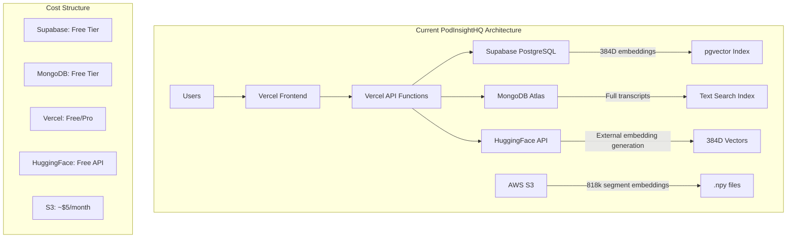
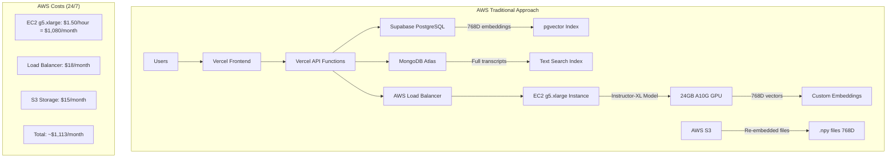
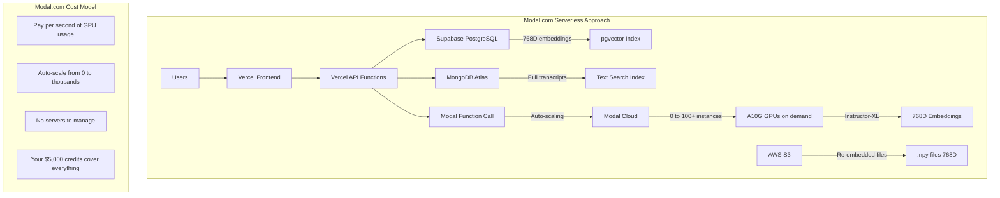
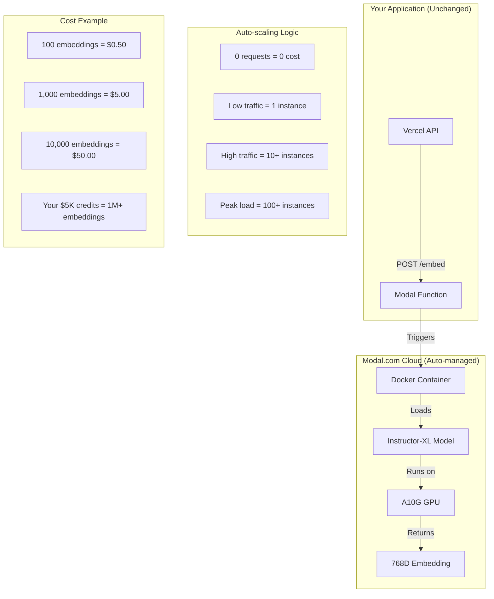
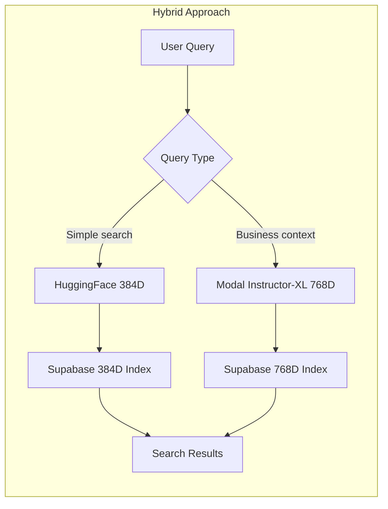
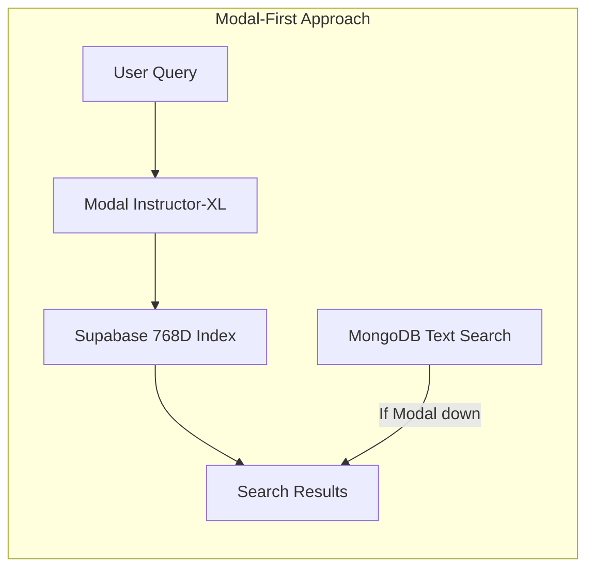

# Modal.com vs Traditional Infrastructure: Visual Comparison

**Date:** June 21, 2025
**Purpose:** Understand Modal.com in context of current infrastructure
**Context:** Instructor-XL deployment options for PodInsightHQ

---

## What is Modal.com?

**Modal.com is a "serverless cloud for AI workloads"** - think AWS Lambda but specifically designed for machine learning models.

### **Key Concept:**
- **Traditional AWS:** You rent servers (EC2) and manage them 24/7
- **Modal.com:** You deploy functions that auto-scale from 0 to thousands based on demand

---

## Current Infrastructure (AS-IS)



### **Current Limitations:**
- **External dependency:** HuggingFace API for embeddings
- **Generic model:** sentence-transformers/all-MiniLM-L6-v2 (384D)
- **No GPU control:** Can't use specialized models
- **API limits:** Rate limiting on HuggingFace
- **Single model:** Stuck with one embedding approach

---

## Option 1: Traditional AWS Upgrade



### **AWS Traditional Pros/Cons:**
**✅ Pros:** Full control, consistent performance, no vendor lock-in
**❌ Cons:** High cost ($13K/year), 24/7 billing, infrastructure management

---

## Option 2: Modal.com Serverless AI



### **Modal.com Pros/Cons:**
**✅ Pros:** Pay per use, auto-scaling, no infrastructure, AI-optimized
**❌ Cons:** Vendor lock-in, cold starts, new technology

---

## Detailed Modal.com Architecture



---

## Code Comparison: How It Works

### **Current Code (HuggingFace API)**
```python
# Current approach in search_lightweight.py
async def generate_embedding_api(text: str) -> List[float]:
    api_url = "https://api-inference.huggingface.co/models/sentence-transformers/all-MiniLM-L6-v2"
    # External API call, rate limited, 384D
    response = await httpx.post(api_url, ...)
    return response.json()
```

### **Modal.com Code (Self-hosted)**
```python
# Modal function (runs in Modal cloud)
import modal

app = modal.App("podinsight-embeddings")

@app.function(
    gpu="A10G",  # Auto-provisioned GPU
    memory=16384,  # 16GB RAM
    timeout=300,  # 5 min timeout
    container_idle_timeout=60  # Keep warm for 1 min
)
def generate_instructor_embedding(instruction: str, text: str) -> List[float]:
    from InstructorEmbedding import INSTRUCTOR
    model = INSTRUCTOR('hkunlp/instructor-xl')  # 768D, business-optimized
    embedding = model.encode([[instruction, text]])
    return embedding[0].tolist()

# Your API calls Modal (replaces HuggingFace)
async def generate_embedding_modal(text: str) -> List[float]:
    instruction = "Represent the Business podcast transcript for retrieval:"
    embedding = generate_instructor_embedding.remote(instruction, text)
    return embedding
```

---

## Performance & Cost Comparison

### **Embedding Generation Performance**

| Approach | Model | Dimensions | Speed | Cost per 1K | Quality |
|----------|-------|------------|-------|-------------|---------|
| **Current (HuggingFace)** | all-MiniLM-L6-v2 | 384D | ~200ms | Free (rate limited) | Generic |
| **AWS 24/7** | Instructor-XL | 768D | ~100ms | $36/month base | Business-optimized |
| **Modal.com** | Instructor-XL | 768D | ~150ms | $0.50 | Business-optimized |

### **Monthly Cost Scenarios**

| Usage Level | Current | AWS EC2 | Modal.com | Your Credits Cover |
|-------------|---------|---------|-----------|-------------------|
| **Low** (1K embeddings/month) | Free | $1,113 | $5 | 1000 months |
| **Medium** (10K embeddings/month) | Free | $1,113 | $50 | 100 months |
| **High** (100K embeddings/month) | Free* | $1,113 | $500 | 10 months |
| **Peak** (1M embeddings/month) | Rate limited | $1,113 | $5,000 | 1 month |

*Rate limited beyond free tier

---

## Migration Scenarios

### **Scenario A: Keep Current + Add Modal for Instructor-XL**


### **Scenario B: Full Migration to Modal**


---

## Infrastructure Management Comparison

### **Traditional AWS Management**
```yaml
Your Responsibilities:
  - Server provisioning and monitoring
  - GPU driver updates
  - Model loading and caching
  - Auto-scaling configuration
  - Load balancer setup
  - Security patches
  - Cost optimization
  - Backup and disaster recovery

Monthly Time Investment: 10-20 hours
```

### **Modal.com Management**
```yaml
Your Responsibilities:
  - Write the function code
  - Deploy with modal deploy
  - Monitor usage in dashboard

Modal Handles:
  - Server provisioning
  - Auto-scaling
  - GPU management
  - Model caching
  - Security updates
  - Monitoring
  - Cost optimization

Monthly Time Investment: 1-2 hours
```

---

## Getting Started with Modal.com

### **Step 1: Account Setup**
```bash
# Install Modal CLI
pip install modal

# Login with your account (use $5K credits)
modal token set --token-id xxx --token-secret xxx
```

### **Step 2: Deploy Test Function**
```python
# test_instructor.py
import modal

app = modal.App("test-instructor")

@app.function(gpu="A10G", memory=16384)
def test_embedding(text: str):
    from InstructorEmbedding import INSTRUCTOR
    model = INSTRUCTOR('hkunlp/instructor-xl')
    instruction = "Represent the Business podcast for retrieval:"
    return model.encode([[instruction, text]])

# Deploy to Modal cloud
# modal deploy test_instructor.py
```

### **Step 3: Call from Your API**
```python
# In your Vercel API
import modal

# Call Modal function
embedding = test_embedding.remote("Sequoia invested in OpenAI")
```

---

## Decision Matrix

| Factor | Current | AWS EC2 | Modal.com |
|--------|---------|---------|-----------|
| **Setup Complexity** | ✅ Simple | ❌ Complex | ✅ Simple |
| **Monthly Cost** | ✅ Free | ❌ $1,113+ | ✅ Pay per use |
| **Performance** | ⚠️ Rate limited | ✅ Consistent | ✅ Auto-scaling |
| **Model Quality** | ❌ Generic 384D | ✅ Business 768D | ✅ Business 768D |
| **Infrastructure Management** | ✅ None | ❌ High | ✅ Minimal |
| **Vendor Lock-in** | ⚠️ HuggingFace | ✅ Portable | ⚠️ Modal-specific |
| **Your Credits Coverage** | N/A | ❌ ~4 months | ✅ Extensive |

---

## Recommendation

### **✅ Start with Modal.com Approach**

**Why Modal.com is Perfect for Your Situation:**

1. **$5,000 credits** = Extensive testing and development runway
2. **Serverless model** = No infrastructure management
3. **AI-optimized** = Built specifically for ML workloads like yours
4. **Auto-scaling** = Handles traffic spikes automatically
5. **Pay per use** = Only pay when generating embeddings

### **Implementation Strategy:**
```
Week 1: Deploy Instructor-XL test function on Modal
Week 2: A/B test Modal vs HuggingFace for 100 episodes
Week 3: If successful, migrate embedding generation to Modal
Week 4: Full production deployment with monitoring

Total estimated credits used: $200-500 (vs $5,000 available)
```

**Modal.com gives you enterprise-grade ML infrastructure without the enterprise complexity or cost.** Perfect for your situation! 🚀

---

*This comparison shows Modal.com as the optimal choice for deploying Instructor-XL with your available credits and infrastructure requirements.*
