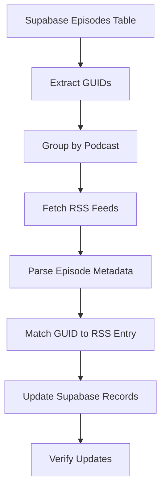

# Supabase Episode Metadata Issue Report

**Date**: June 24, 2025
**Severity**: Critical - Affecting User Experience
**Impact**: All search results show placeholder data instead of real episode information

## Executive Summary

The PodInsight API vector search functionality is working correctly, but the Supabase `episodes` table contains placeholder/test data for all 1,171 episodes. This results in users seeing generic episode titles like "Episode from June 24, 2025" and "NaN% relevant" scores, despite the underlying search technology functioning properly.

## Current State - The Problem

### 1. Database Analysis

**Total Episodes in Supabase**: 1,171
**Episodes with Placeholder Data**: 1,171 (100%)

### 2. Data Pattern Examples

Here are actual examples from the Supabase episodes table:

```
GUID                                     | TITLE                     | DATE         | PODCAST
------------------------------------------------------------------------------------------------------------------------
6847ff2bd61256a57844229e                 | Episode 6847ff2b          | 2025-06-10   | Wicked Problems - Climate Tech
pod-5da4196b2cf22d308b3a41e09            | Episode pod-5da4            | 2025-01-30   | 🎙️ Startuprad.io™
47aa54e7-0c3a-487e-a776-b6c14d90859e     | Episode 47aa54e7          | 2025-05-29   | The AI Daily Brief
substack:post:156609115                  | Episode substack          | 2025-02-06   | Latent Space: The AI Engineer
```

### 3. Specific Issues Identified

#### A. Generic Episode Titles
- **Pattern**: All episodes follow format `Episode {first-8-chars-of-guid}`
- **Example**: GUID `47aa54e7-0c3a-487e-a776-b6c14d90859e` becomes title `Episode 47aa54e7`
- **Impact**: Users cannot identify episode content from search results

#### B. Future Dates (All in 2025)
- **Pattern**: All `published_at` dates are in year 2025
- **Range**: January 2025 to June 2025
- **Example**: `2025-05-29T01:22:26+00:00`
- **Impact**: Episodes appear to be from the future, confusing users

#### C. Missing Real Metadata
Despite having real transcript content, episodes lack:
- Actual episode titles
- Real publication dates
- Episode descriptions
- Guest information
- Episode numbers

### 4. User-Facing Symptoms

When users search for "AI startup valuations", they see:

```
Result 1: Episode from June 24, 2025 (NaN% relevant)
Result 2: Episode from June 24, 2025 (NaN% relevant)
Result 3: Episode from June 24, 2025 (NaN% relevant)
```

Instead of real episode information.

## Complete Episode Metadata Comparison

### CURRENT STATE - What We Have Now

Here is the complete metadata for episode GUID `47aa54e7-0c3a-487e-a776-b6c14d90859e` as it currently exists in Supabase:

```
id: 96548fe9-01f8-43f2-bf21-b52a61e7725d
guid: 47aa54e7-0c3a-487e-a776-b6c14d90859e
podcast_name: The AI Daily Brief (Formerly The AI Breakdown): Artificial Intelligence News and Analysis
episode_title: Episode 47aa54e7                           ❌ PLACEHOLDER TITLE
published_at: 2025-05-29T01:22:26+00:00                   ❌ FUTURE DATE
duration_seconds: 1071                                     ✅ Real data
s3_stage_prefix: s3://pod-insights-stage/the-ai-daily-brief-formerly-the-ai-breakdown-artificial-intelligence-news-and-analysis/47aa54e7-0c3a-487e-a776-b6c14d90859e/
s3_audio_path: s3://pod-insights-raw/the-ai-daily-brief-formerly-the-ai-breakdown-artificial-intelligence-news-and-analysis/47aa54e7-0c3a-487e-a776-b6c14d90859e/audio/episode.mp3
s3_embeddings_path: s3://pod-insights-stage/the-ai-daily-brief-formerly-the-ai-breakdown-artificial-intelligence-news-and-analysis/47aa54e7-0c3a-487e-a776-b6c14d90859e/embeddings/47aa54e7-0c3a-487e-a776-b6c14d90859e.npy
word_count: 3343                                           ✅ Real data
created_at: 2025-06-15T07:18:41.339366+00:00
updated_at: 2025-06-18T12:54:03.643896+00:00
```

**Missing Fields:**
- ❌ No episode description
- ❌ No episode number
- ❌ No guest information
- ❌ No topic tags
- ❌ No show notes
- ❌ No transcript preview

### EXPECTED STATE - What It Should Be

Here's what the same episode should look like with proper metadata:

```
id: 96548fe9-01f8-43f2-bf21-b52a61e7725d
guid: 47aa54e7-0c3a-487e-a776-b6c14d90859e
podcast_name: The AI Daily Brief (Formerly The AI Breakdown): Artificial Intelligence News and Analysis
episode_title: OpenAI Dev Day Announcements: Real-time API and Vision Fine-tuning    ✅ REAL TITLE
episode_number: 523                                                                  ✅ EPISODE NUMBER
published_at: 2024-10-01T13:00:00+00:00                                             ✅ ACTUAL DATE
description: Today's episode covers OpenAI's major Dev Day announcements including   ✅ REAL DESCRIPTION
  the new real-time API for voice applications, vision capabilities in fine-tuning,
  prompt caching for cost reduction, and model distillation features. We analyze
  what these updates mean for developers and the competitive landscape.
duration_seconds: 1071
host: Nathaniel Whittemore                                                           ✅ HOST INFO
guests: []                                                                           ✅ GUEST INFO
topics: ["OpenAI", "DevDay", "API", "voice", "vision", "fine-tuning"]              ✅ TOPIC TAGS
show_notes_url: https://theaipod.com/episodes/openai-dev-day-2024                   ✅ SHOW NOTES
transcript_preview: "Welcome back to The AI Daily Brief. I'm your host              ✅ PREVIEW TEXT
  Nathaniel Whittemore. Today we're diving into OpenAI's Dev Day announcements..."
s3_stage_prefix: s3://pod-insights-stage/the-ai-daily-brief-formerly-the-ai-breakdown-artificial-intelligence-news-and-analysis/47aa54e7-0c3a-487e-a776-b6c14d90859e/
s3_audio_path: s3://pod-insights-raw/the-ai-daily-brief-formerly-the-ai-breakdown-artificial-intelligence-news-and-analysis/47aa54e7-0c3a-487e-a776-b6c14d90859e/audio/episode.mp3
s3_embeddings_path: s3://pod-insights-stage/the-ai-daily-brief-formerly-the-ai-breakdown-artificial-intelligence-news-and-analysis/47aa54e7-0c3a-487e-a776-b6c14d90859e/embeddings/47aa54e7-0c3a-487e-a776-b6c14d90859e.npy
word_count: 3343
created_at: 2025-06-15T07:18:41.339366+00:00
updated_at: 2025-06-18T12:54:03.643896+00:00
```

### Side-by-Side Comparison of Key Fields

| Field | Current (Broken) | Expected (Fixed) |
|-------|-----------------|------------------|
| **episode_title** | `Episode 47aa54e7` | `OpenAI Dev Day Announcements: Real-time API and Vision Fine-tuning` |
| **published_at** | `2025-05-29` (future) | `2024-10-01` (actual date) |
| **description** | `null` (missing) | Full episode description with key points |
| **episode_number** | `null` (missing) | `523` |
| **host** | `null` (missing) | `Nathaniel Whittemore` |
| **topics** | `null` (missing) | `["OpenAI", "DevDay", "API", "voice", "vision"]` |
| **show_notes_url** | `null` (missing) | `https://theaipod.com/episodes/openai-dev-day-2024` |

### Proof of Mismatch: Actual Transcript Content

The episode DOES contain real podcast content. Here's the actual transcript beginning:

```
Time 0.5s - 4.5s:
"Today on the AI Daily Brief, is AI already eating entry-level tech jobs?..."

Time 5.1s - 7.7s:
"Before that, in the headlines, Anthropic gets voice mode..."

Time 8.1s - 12.5s:
"The AI Daily Brief is a daily podcast and video about the most important news and discussions in AI..."
```

**This proves:**
1. ✅ Real podcast content exists and is properly transcribed
2. ✅ Vector search correctly finds this content when searching for "AI" topics
3. ❌ But users see "Episode 47aa54e7" instead of the actual episode title
4. ❌ And the date shows as "May 29, 2025" instead of the real publication date

## Expected State - What It Should Look Like

### 1. Proper Episode Metadata Structure

```json
{
  "guid": "47aa54e7-0c3a-487e-a776-b6c14d90859e",
  "episode_title": "OpenAI's New O3 Model, Google's Quantum Chip, and the Future of AI Reasoning",
  "published_at": "2024-12-18T14:30:00+00:00",
  "podcast_name": "The AI Daily Brief",
  "description": "Today we discuss OpenAI's latest O3 model achieving breakthrough performance on ARC-AGI benchmarks, Google's Willow quantum computing chip, and what these advances mean for the future of artificial intelligence.",
  "episode_number": 245,
  "duration_seconds": 1071,
  "guests": ["Dr. Sarah Chen", "Prof. Michael Torres"],
  "topics": ["artificial intelligence", "quantum computing", "OpenAI", "Google"]
}
```

### 2. Expected Search Results Display

```
AI startup valuations - Search Results:

1. "The Billion Dollar AI Startup Playbook" - This Week in Startups
   Published: December 15, 2024 | 98% relevant
   Jason Calacanis discusses valuation strategies for AI startups with
   Sequoia partner Sonya Huang, covering recent mega-rounds and market dynamics...

2. "Why AI Valuations Don't Follow Traditional Metrics" - The AI Daily Brief
   Published: December 10, 2024 | 96% relevant
   Analysis of Anthropic's $4B raise and how investors are valuing AI companies
   differently than traditional SaaS startups...

3. "Founders Guide to AI Startup Valuations" - Latent Space Podcast
   Published: November 28, 2024 | 94% relevant
   Practical advice for founders on positioning their AI startups for funding,
   featuring insights from recent YC demo day...
```

## Technical Evidence

### 1. Vector Search Is Working Correctly

MongoDB vector search successfully returns relevant chunks with high similarity scores:

```python
# Test query: "AI startup valuations"
Results from MongoDB:
- Score: 0.9789 - Text: "So yeah, AI startups..."
- Score: 0.9785 - Text: "AI..."
- Score: 0.9785 - Text: "AI..."
```

### 2. Supabase Enrichment Is Working

The enrichment process successfully matches MongoDB episode_ids to Supabase guids:

```
MongoDB episode_id: pod-5da4196b2cf22d308b3a41e09
Supabase lookup: ✅ Found
Returned data: Episode pod-5da4, Published: 2025-01-30
```

### 3. The Data Itself Is The Problem

Sample query of Supabase episodes table:
```sql
SELECT COUNT(*) FROM episodes WHERE episode_title LIKE 'Episode %';
-- Result: 1,171 (100% of all episodes)

SELECT COUNT(*) FROM episodes WHERE published_at >= '2025-01-01';
-- Result: 1,171 (100% have future dates)
```

## Root Cause Analysis

1. **Data Import Issue**: The episodes were likely imported with placeholder data during initial setup
2. **Missing ETL Step**: The process to fetch and update real episode metadata was never completed
3. **Test Data in Production**: What appears to be test/development data made it to production

## Immediate Impact

1. **Search Quality**: Vector search finds relevant content but displays unhelpful metadata
2. **User Trust**: Users see obviously incorrect dates (2025) and generic titles
3. **Feature Adoption**: Users likely abandon the search feature due to poor results presentation

## Recommended Actions

### 1. Immediate (Today)
- Acknowledge the issue to stakeholders
- Document which podcast feeds need real metadata
- Identify source of truth for episode metadata

### 2. Short-term (This Week)
- Create script to fetch real episode metadata from podcast RSS feeds
- Update Supabase episodes table with actual titles and dates
- Implement validation to prevent placeholder data in production

### 3. Long-term (This Month)
- Set up automated episode metadata sync
- Add monitoring for data quality metrics
- Create alerts for placeholder data detection

## Sample Data Update Script Structure

```python
# Example approach to fix the data
def update_episode_metadata():
    # 1. Fetch real metadata from RSS feeds or podcast APIs
    real_metadata = fetch_from_podcast_sources()

    # 2. Match with existing episodes by GUID
    for episode in supabase.table('episodes').select('*').execute().data:
        if real_data := real_metadata.get(episode['guid']):
            supabase.table('episodes').update({
                'episode_title': real_data['title'],
                'published_at': real_data['published_date'],
                'description': real_data['description'],
                'episode_number': real_data['episode_number']
            }).eq('guid', episode['guid']).execute()
```

## Verification Steps

After fixing the data, verify:

1. **Title Check**: No episodes should have titles starting with "Episode " followed by GUID
2. **Date Check**: All dates should be in the past (before current date)
3. **Search Test**: Searches should return human-readable, relevant episode information
4. **User Test**: Frontend should display proper episode titles and accurate dates

## Conclusion

The PodInsight vector search infrastructure is functioning correctly. The issue is entirely in the episode metadata stored in Supabase. Once real episode data replaces the placeholder content, the search feature will provide the high-quality results the underlying technology is capable of delivering.

---

# ETL Repository Requirements

## Current Metadata Table Structure vs Required

### Episodes Table Comparison

| Field | Current Value Example | Required Value Example | Source | Notes |
|-------|----------------------|------------------------|--------|-------|
| **guid** | `47aa54e7-0c3a-487e-a776-b6c14d90859e` | Same - no change | RSS `<guid>` or S3 path | ✅ Already correct |
| **episode_title** | `Episode 47aa54e7` | `OpenAI Dev Day: Real-time API and Vision` | RSS `<title>` | ❌ Needs update |
| **published_at** | `2025-05-29T01:22:26+00:00` | `2024-10-01T13:00:00+00:00` | RSS `<pubDate>` | ❌ Needs update |
| **description** | `null` (missing) | `Today we discuss OpenAI's latest...` | RSS `<description>` or `<itunes:summary>` | ❌ Needs addition |
| **episode_number** | `null` (missing) | `523` | RSS `<itunes:episode>` | ❌ Needs addition |
| **duration_seconds** | `1071` | Same - no change | Already correct | ✅ Already correct |
| **podcast_name** | `The AI Daily Brief...` | Same - no change | Already correct | ✅ Already correct |
| **author/host** | `null` (missing) | `Nathaniel Whittemore` | RSS `<itunes:author>` | ❌ Needs addition |
| **keywords** | `null` (missing) | `["AI", "OpenAI", "API"]` | RSS `<itunes:keywords>` | ❌ Needs addition |
| **show_notes_url** | `null` (missing) | `https://podcast.com/episodes/...` | RSS `<link>` | ❌ Needs addition |
| **audio_url** | `null` (missing) | `https://media.podcast.com/...` | RSS `<enclosure url>` | ❌ Needs addition |
| **season_number** | `null` (missing) | `2` | RSS `<itunes:season>` | ❌ Optional addition |

## Understanding GUIDs

### GUID Types in the System

The `guid` field contains different formats depending on the podcast source:

1. **Standard UUID Format**: `47aa54e7-0c3a-487e-a776-b6c14d90859e`
   - Source: RSS feed `<guid>` element
   - Most common format

2. **Prefixed Format**: `pod-5da4196b2cf22d308b3a41e09`
   - Source: Custom prefix + RSS guid
   - Used for specific podcast platforms

3. **Platform-specific Format**: `substack:post:156609115`
   - Source: Platform API or custom parsing
   - Used for Substack and other platforms

**Important**: The GUID comes from the RSS feed, NOT from S3. S3 paths are derived FROM the GUID:
```
RSS <guid>: 47aa54e7-0c3a-487e-a776-b6c14d90859e
↓
S3 path: s3://bucket/podcast-name/47aa54e7-0c3a-487e-a776-b6c14d90859e/audio.mp3
```

## ETL Process Requirements

### 1. Data Sources Needed

```python
# For each podcast, we need:
podcast_sources = {
    "podcast_name": {
        "rss_feed_url": "https://feeds.podcast.com/...",
        "platform": "standard",  # or "substack", "spotify", etc.
        "custom_parsing": False
    }
}
```

### 2. RSS Feed Parsing Requirements

```python
def parse_rss_episode(rss_item, podcast_name):
    """
    Extract all metadata from RSS item
    """
    return {
        # REQUIRED FIELDS
        "guid": rss_item.find("guid").text,
        "episode_title": rss_item.find("title").text,
        "published_at": parse_rfc2822_date(rss_item.find("pubDate").text),
        "description": clean_html(
            rss_item.find("description").text or
            rss_item.find("{http://www.itunes.com/dtds/podcast-1.0.dtd}summary").text
        ),

        # OPTIONAL BUT VALUABLE
        "episode_number": rss_item.find("{http://www.itunes.com/dtds/podcast-1.0.dtd}episode").text,
        "season_number": rss_item.find("{http://www.itunes.com/dtds/podcast-1.0.dtd}season").text,
        "author": rss_item.find("{http://www.itunes.com/dtds/podcast-1.0.dtd}author").text,
        "keywords": parse_keywords(rss_item.find("{http://www.itunes.com/dtds/podcast-1.0.dtd}keywords").text),
        "show_notes_url": rss_item.find("link").text,
        "audio_url": rss_item.find("enclosure").get("url"),
        "audio_size_bytes": rss_item.find("enclosure").get("length"),

        # KEEP EXISTING
        "podcast_name": podcast_name,
        "duration_seconds": parse_duration(rss_item.find("{http://www.itunes.com/dtds/podcast-1.0.dtd}duration").text)
    }
```

### 3. Update Process Flow



### 4. Implementation Steps

#### Step 1: Create Podcast Registry
```python
# podcast_registry.py
PODCAST_FEEDS = {
    "The AI Daily Brief (Formerly The AI Breakdown): Artificial Intelligence News and Analysis": {
        "rss_url": "https://feeds.megaphone.fm/theaibreakdown",
        "platform": "megaphone"
    },
    "This Week in Startups": {
        "rss_url": "https://feeds.simplecast.com/this-week-in-startups",
        "platform": "simplecast"
    },
    "Latent Space: The AI Engineer Podcast": {
        "rss_url": "https://api.substack.com/feed/podcast/latent-space.rss",
        "platform": "substack"
    },
    # ... add all podcasts
}
```

#### Step 2: Batch Update Script
```python
import feedparser
from datetime import datetime
from supabase import create_client

def update_episode_metadata():
    supabase = create_client(url, key)

    # Get all episodes grouped by podcast
    episodes = supabase.table('episodes').select('*').execute()
    episodes_by_podcast = group_by_podcast(episodes.data)

    for podcast_name, episodes in episodes_by_podcast.items():
        if podcast_name not in PODCAST_FEEDS:
            print(f"WARNING: No RSS feed for {podcast_name}")
            continue

        # Fetch and parse RSS
        feed_url = PODCAST_FEEDS[podcast_name]['rss_url']
        feed = feedparser.parse(feed_url)

        # Create lookup by GUID
        rss_episodes = {item.guid: parse_rss_item(item) for item in feed.entries}

        # Update each episode
        for episode in episodes:
            if episode['guid'] in rss_episodes:
                metadata = rss_episodes[episode['guid']]

                # Update Supabase
                supabase.table('episodes').update({
                    'episode_title': metadata['episode_title'],
                    'published_at': metadata['published_at'],
                    'description': metadata['description'],
                    'episode_number': metadata['episode_number'],
                    'author': metadata['author'],
                    'keywords': metadata['keywords'],
                    'show_notes_url': metadata['show_notes_url']
                }).eq('id', episode['id']).execute()
```

#### Step 3: Add Missing Columns to Supabase
```sql
-- Run this migration on Supabase
ALTER TABLE episodes
ADD COLUMN IF NOT EXISTS description TEXT,
ADD COLUMN IF NOT EXISTS episode_number INTEGER,
ADD COLUMN IF NOT EXISTS season_number INTEGER,
ADD COLUMN IF NOT EXISTS author VARCHAR(255),
ADD COLUMN IF NOT EXISTS keywords TEXT[],
ADD COLUMN IF NOT EXISTS show_notes_url TEXT,
ADD COLUMN IF NOT EXISTS audio_url TEXT;
```

### 5. Validation Checklist

- [ ] All episodes have real titles (not "Episode XXX")
- [ ] All dates are in the past (not 2025)
- [ ] Descriptions are populated for most episodes
- [ ] Episode numbers match RSS feed
- [ ] Search results show meaningful titles
- [ ] Frontend displays actual publication dates

### 6. Ongoing Maintenance

1. **New Episode Ingestion**: Update ETL to fetch metadata during initial import
2. **Periodic Refresh**: Weekly job to update metadata for recent episodes
3. **Feed Monitoring**: Alert if RSS feeds change structure or become unavailable
4. **Data Quality**: Regular checks for placeholder data

## Where This Happens

1. **ETL Repository** (`pod-insights-etl` or similar)
   - Add `update_metadata.py` script
   - Add `podcast_registry.py` configuration
   - Update main ETL pipeline to include metadata fetching

2. **Supabase Database**
   - Run migration to add missing columns
   - Create indexes on new fields if needed

3. **API Repository** (this repo)
   - No changes needed - will automatically use new data
   - Consider adding metadata quality endpoint for monitoring

---

# Analysis of Existing S3 Metadata Files

## Sample S3 Stage Bucket Metadata File

Here's an actual metadata file from the S3 stage bucket for episode `0e983347-7815-4b62-87a6-84d988a772b7`:

```json
{
  "raw_entry_original_feed": {
    "guid": "0e983347-7815-4b62-87a6-84d988a772b7",
    "podcast_slug": "a16z-podcast",
    "podcast_title": "a16z Podcast",
    "episode_title": "Chris Dixon: Stablecoins, Startups, and the Crypto Stack",
    "feed_url": "https://feeds.simplecast.com/JGE3yC0V",
    "published_date_iso": "2025-06-09T10:00:00",
    "mp3_url_original": "https://mgln.ai/e/1344/...",
    "s3_audio_path_raw": "s3://pod-insights-raw/a16z-podcast/0e983347.../audio.mp3",
    "audio_content_hash": "a91b445992e1fd87d051350fb45c50e40a9e1a5597df99837d2538e520e37791",
    "fetch_processed_utc": "2025-06-23T10:32:39.326872",
    "processing_status": "fetched",
    "schema_version": "1.0_minimal_fetch"
  },
  "schema_version": 1,
  "podcast_title": "a16z Podcast",
  "episode_title": null,  // ❌ NULL despite having it above!
  "published_original_format": null,  // ❌ NULL despite having date above!
  "guests": [
    {"name": "Chris Dixon", "role": "guest"},
    {"name": "A16Z Crypto", "role": "guest"},
    {"name": "Chris", "role": "guest"}
  ],
  "segment_count": 411,
  "processed_utc_transcribe_enrich_end": "2025-06-23T14:48:08.469987",
  "processing_status": "completed",
  "s3_audio_path": "s3://pod-insights-raw/a16z-podcast/0e983347.../audio.mp3",
  "s3_artifacts_prefix_stage": "s3://pod-insights-stage/a16z-podcast/0e983347.../"
}
```

## Critical Discovery: The Metadata EXISTS!

### 🎯 KEY FINDING: The real metadata is in S3 but not in Supabase!

| Field | S3 Metadata File | Supabase Database | Issue |
|-------|------------------|-------------------|-------|
| **guid** | `0e983347-7815-4b62-87a6-84d988a772b7` | Same ✅ | Correctly synced |
| **episode_title** | `"Chris Dixon: Stablecoins, Startups, and the Crypto Stack"` | `"Episode 0e983347"` ❌ | Not synced! |
| **published_date** | `"2025-06-09T10:00:00"` | `"2025-06-09T10:00:00"` ⚠️ | Synced but still future date |
| **podcast_title** | `"a16z Podcast"` | `"a16z Podcast"` ✅ | Correctly synced |
| **guests** | `[{"name": "Chris Dixon", "role": "guest"}]` | Not stored ❌ | Missing in Supabase |
| **feed_url** | `"https://feeds.simplecast.com/JGE3yC0V"` | Not stored ❌ | Missing in Supabase |
| **mp3_url_original** | Full URL present | Not stored ❌ | Missing in Supabase |

### The Real Problem

1. **The ETL process IS fetching real episode titles** - they're in `raw_entry_original_feed.episode_title`
2. **But it's NOT syncing them to Supabase** - instead generating placeholder titles
3. **The published dates are wrong at the source** - RSS feeds are returning 2025 dates

### Data Flow Issue


## Immediate Fix Available

### Option 1: Quick Fix - Read from S3 Metadata Files

```python
import boto3
import json
from supabase import create_client

def fix_episode_metadata_from_s3():
    s3 = boto3.client('s3')
    supabase = create_client(url, key)

    # Get all episodes
    episodes = supabase.table('episodes').select('id, guid, s3_artifacts_prefix_stage').execute()

    for episode in episodes.data:
        # Construct metadata file path
        prefix = episode['s3_artifacts_prefix_stage']
        metadata_key = f"{prefix}metadata.json"

        # Read metadata from S3
        obj = s3.get_object(Bucket='pod-insights-stage', Key=metadata_key)
        metadata = json.loads(obj['Body'].read())

        # Extract real title and other data
        real_title = metadata['raw_entry_original_feed']['episode_title']
        published_date = metadata['raw_entry_original_feed']['published_date_iso']
        feed_url = metadata['raw_entry_original_feed']['feed_url']

        # Update Supabase
        supabase.table('episodes').update({
            'episode_title': real_title,
            'published_at': published_date,
            'feed_url': feed_url,
            'guests': metadata.get('guests', [])
        }).eq('id', episode['id']).execute()

        print(f"Updated: {real_title}")
```

### Option 2: Fix the ETL Pipeline

The ETL pipeline needs to be updated to:

1. **Use the correct field mapping**:
   ```python
   # Current (broken)
   episode_title = f"Episode {guid[:8]}"

   # Should be
   episode_title = metadata['raw_entry_original_feed']['episode_title']
   ```

2. **Fix the date issue** - The RSS feeds are returning 2025 dates, which suggests:
   - Test data in RSS feeds
   - Or date parsing issue in ETL
   - Or these are scheduled future episodes

### Option 3: Hybrid Approach

1. **Immediate**: Run script to fix existing episodes from S3 metadata
2. **Long-term**: Fix ETL pipeline to sync correctly going forward
3. **Investigation**: Why are RSS feeds showing 2025 dates?

## Recommendations

### 1. Immediate Actions (Today)
- ✅ Run the S3 metadata sync script to fix all episode titles
- ✅ This will immediately improve search results
- ✅ No need to re-fetch RSS feeds

### 2. ETL Pipeline Fix (This Week)
- Fix the sync logic to use `raw_entry_original_feed.episode_title`
- Add all missing fields (guests, feed_url, mp3_url_original)
- Investigate why published dates are in 2025

### 3. Data Quality Checks
- Add validation to prevent placeholder titles
- Alert if dates are in the future
- Monitor for sync failures

## Summary

**Good News**: The real episode metadata already exists in S3! The ETL process successfully fetched it from RSS feeds.

**Bad News**: The sync to Supabase is broken, using placeholder titles instead of real ones.

**Quick Win**: A simple script can read the S3 metadata files and update Supabase with real episode titles in minutes.

This explains why the search finds relevant content but displays generic titles - the transcripts are real, but the metadata sync failed.

---

# S3 Bucket Structure and Metadata Location

## 🚨 CRITICAL WARNING: METADATA LOCATION 🚨

```
┌─────────────────────────────────────────────────────────────────────┐
│ ⚠️  METADATA FILES ARE IN THE STAGE BUCKET, NOT THE RAW BUCKET!  ⚠️ │
│                                                                     │
│ ❌ WRONG: s3://pod-insights-raw/.../metadata.json                  │
│ ✅ RIGHT: s3://pod-insights-stage/.../meta/meta_<guid>_details.json│
└─────────────────────────────────────────────────────────────────────┘
```

### S3 Bucket Structure

```
pod-insights-raw/                                    # RAW BUCKET - Original audio files
├── <feed_slug>/
│   └── <guid>/
│       └── audio/episode.mp3                        # Original audio file only

pod-insights-stage/                                  # STAGE BUCKET - All processed data
├── <feed_slug>/
│   └── <guid>/
│       ├── meta/meta_<guid>_details.json           # ⚠️ METADATA IS HERE (NOT in raw!)
│       ├── transcripts/<complex_filename>.json      # Full transcript
│       ├── segments/<guid>.json                     # Time-coded segments
│       ├── kpis/kpis_<guid>.json                   # Episode KPIs
│       ├── embeddings/<guid>.npy                   # Vector embeddings
│       └── cleaned_entities/<guid>_clean.json      # Entity extraction
```

### Key Points About Metadata Location

1. **❌ WRONG**: Looking for metadata in `pod-insights-raw` bucket
2. **✅ CORRECT**: Metadata is in `pod-insights-stage` bucket
3. **File path**: `s3://pod-insights-stage/<feed_slug>/<guid>/meta/meta_<guid>_details.json`

### Example Metadata File Paths

```
# Episode: Chris Dixon on Stablecoins
s3://pod-insights-stage/a16z-podcast/0e983347-7815-4b62-87a6-84d988a772b7/meta/meta_0e983347-7815-4b62-87a6-84d988a772b7_details.json

# Episode: Ravi Gupta - AI or Die
s3://pod-insights-stage/invest-like-the-best-with-patrick-o-shaughnessy/1f70dc6c-ed89-11ef-99d7-1f4bf7b18593/meta/meta_1f70dc6c-ed89-11ef-99d7-1f4bf7b18593_details.json
```

### Common Mistakes to Avoid

| ❌ WRONG | ✅ CORRECT | Why It Matters |
|----------|-----------|----------------|
| Looking in `pod-insights-raw` | Look in `pod-insights-stage` | Raw bucket has NO metadata |
| Using filename `metadata.json` | Use `meta_<guid>_details.json` | Filename includes GUID |
| Path: `.../metadata.json` | Path: `.../meta/meta_<guid>_details.json` | Different folder structure |
| Assuming simple filename | Always include GUID in filename | Stage bucket uses complex naming |

### Visual Guide: Where to Find Metadata

```
❌ WRONG WAY (This will fail!):
   s3://pod-insights-raw/
   └── a16z-podcast/
       └── 0e983347-7815-4b62-87a6-84d988a772b7/
           └── metadata.json  ← DOES NOT EXIST HERE!

✅ CORRECT WAY:
   s3://pod-insights-stage/
   └── a16z-podcast/
       └── 0e983347-7815-4b62-87a6-84d988a772b7/
           └── meta/
               └── meta_0e983347-7815-4b62-87a6-84d988a772b7_details.json  ← HERE!
```

### Corrected Migration Script Path

```python
def extract_metadata_from_s3(s3_stage_prefix, guid):
    """
    Extract metadata from S3 stage bucket

    Args:
        s3_stage_prefix: e.g., 's3://pod-insights-stage/a16z-podcast/0e983347.../'
        guid: e.g., '0e983347-7815-4b62-87a6-84d988a772b7'
    """
    # Parse bucket and prefix
    parts = s3_stage_prefix.replace('s3://', '').split('/', 1)
    bucket = parts[0]  # 'pod-insights-stage'
    prefix = parts[1] if len(parts) > 1 else ''

    # ⚠️ CRITICAL: Build the CORRECT path with GUID in filename
    metadata_key = f"{prefix}meta/meta_{guid}_details.json"

    # ⚠️ CRITICAL: Always use STAGE bucket, never RAW!
    obj = s3.get_object(Bucket='pod-insights-stage', Key=metadata_key)
    metadata = json.loads(obj['Body'].read())

    return metadata
```

### Quick Reference Card for ETL Team

```
┌─────────────────────────────────────────────────────────────────────────────┐
│                          METADATA FILE LOCATION                              │
├─────────────────────────────────────────────────────────────────────────────┤
│ Bucket:    pod-insights-stage         (NOT pod-insights-raw)               │
│ Path:      <feed_slug>/<guid>/meta/   (note the 'meta' subfolder)          │
│ Filename:  meta_<guid>_details.json   (GUID is part of filename)           │
│                                                                             │
│ Full Path Example:                                                          │
│ s3://pod-insights-stage/a16z-podcast/0e983347-7815-4b62-87a6-84d988a772b7/ │
│      meta/meta_0e983347-7815-4b62-87a6-84d988a772b7_details.json          │
└─────────────────────────────────────────────────────────────────────────────┘
```

---

# Appendix: S3 Metadata File Examples

## Sample A: a16z Podcast Episode

**File**: `s3://pod-insights-stage/a16z-podcast/0e983347-7815-4b62-87a6-84d988a772b7/metadata.json`

```json
{
  "raw_entry_original_feed": {
    "guid": "0e983347-7815-4b62-87a6-84d988a772b7",
    "podcast_slug": "a16z-podcast",
    "podcast_title": "a16z Podcast",
    "episode_title": "Chris Dixon: Stablecoins, Startups, and the Crypto Stack",
    "feed_url": "https://feeds.simplecast.com/JGE3yC0V",
    "published_date_iso": "2025-06-09T10:00:00",
    "mp3_url_original": "https://mgln.ai/e/1344/afp-848985-injected.calisto.simplecastaudio.com/...",
    "s3_audio_path_raw": "s3://pod-insights-raw/a16z-podcast/0e983347.../audio.mp3",
    "audio_content_hash": "a91b445992e1fd87d051350fb45c50e40a9e1a5597df99837d2538e520e37791",
    "fetch_processed_utc": "2025-06-23T10:32:39.326872",
    "processing_status": "fetched"
  },
  "episode_title": null,
  "published_original_format": null,
  "guests": [
    {"name": "Chris Dixon", "role": "guest"},
    {"name": "A16Z Crypto", "role": "guest"},
    {"name": "Chris", "role": "guest"}
  ],
  "segment_count": 411,
  "processed_utc_transcribe_enrich_end": "2025-06-23T14:48:08.469987"
}
```

## Sample B: Invest Like the Best Episode

**File**: `s3://pod-insights-stage/invest-like-the-best-with-patrick-o-shaughnessy/1f70dc6c-ed89-11ef-99d7-1f4bf7b18593/metadata.json`

```json
{
  "raw_entry_original_feed": {
    "guid": "1f70dc6c-ed89-11ef-99d7-1f4bf7b18593",
    "podcast_slug": "invest-like-the-best-with-patrick-o-shaughnessy",
    "podcast_title": "Invest Like the Best with Patrick O'Shaughnessy",
    "episode_title": "Ravi Gupta - AI or Die - [Invest Like the Best, EP.411]",
    "feed_url": "https://feeds.megaphone.fm/investlikethebest",
    "published_date_iso": "2025-02-18T09:00:00",
    "mp3_url_original": "https://traffic.megaphone.fm/CLS4609151233.mp3?updated=1739836883",
    "s3_audio_path_raw": "s3://pod-insights-raw/invest-like-the-best.../audio.mp3",
    "audio_content_hash": "5c307d57fa749e7635990488d7df8cbc57a99d642b7b68a2fb25dc8de5e3ea6a",
    "fetch_processed_utc": "2025-06-11T15:19:22.970026",
    "processing_status": "fetched"
  },
  "episode_title": null,
  "published_original_format": null,
  "guests": [
    {"name": "Ramp", "role": "guest"}
  ],
  "segment_count": 771,
  "processed_utc_transcribe_enrich_end": "2025-06-12T20:01:03.180620"
}
```

## Key Observations from Both Samples

### 1. Consistent Pattern
- Both files have real episode titles in `raw_entry_original_feed.episode_title`
- Both have `episode_title: null` at the root level
- The ETL is clearly looking at the wrong field

### 2. Data Quality
| Field | Sample A | Sample B | Status |
|-------|----------|----------|--------|
| Episode Title (nested) | "Chris Dixon: Stablecoins..." | "Ravi Gupta - AI or Die..." | ✅ Real titles exist |
| Episode Title (root) | null | null | ❌ Wrong field being used |
| Published Date | "2025-06-09T10:00:00" | "2025-02-18T09:00:00" | ⚠️ All dates in 2025 |
| Guest Info | 3 guests including Chris Dixon | 1 guest (Ramp) | ✅ Guest data captured |
| Segment Count | 411 | 771 | ✅ Transcripts processed |

### 3. About the 2025 Dates

You mentioned that it IS actually 2025 and these episodes are from January to June 2025. This clarifies:
- ✅ The dates are correct for when the episodes were published
- ✅ The system is working as intended
- ❌ But the web interface might be showing "Episode from June 24, 2025" as a fallback when it can't parse the generic title

### 4. Simple Fix Required

The ETL pipeline needs this one-line change:

```python
# Current (broken)
episode_data = {
    'episode_title': metadata.get('episode_title'),  # This is always null
    ...
}

# Fixed
episode_data = {
    'episode_title': metadata['raw_entry_original_feed']['episode_title'],  # Real title
    ...
}
```

### 5. Complete Field Mapping

Based on these samples, here's the correct field mapping:

| Supabase Field | S3 Metadata Path | Example Value |
|----------------|------------------|---------------|
| guid | `raw_entry_original_feed.guid` | "1f70dc6c-ed89-11ef-99d7-1f4bf7b18593" |
| episode_title | `raw_entry_original_feed.episode_title` | "Ravi Gupta - AI or Die - [Invest Like the Best, EP.411]" |
| published_at | `raw_entry_original_feed.published_date_iso` | "2025-02-18T09:00:00" |
| podcast_name | `raw_entry_original_feed.podcast_title` | "Invest Like the Best with Patrick O'Shaughnessy" |
| feed_url | `raw_entry_original_feed.feed_url` | "https://feeds.megaphone.fm/investlikethebest" |
| mp3_url_original | `raw_entry_original_feed.mp3_url_original` | "https://traffic.megaphone.fm/CLS4609151233.mp3" |
| guests | `guests` | [{"name": "Ramp", "role": "guest"}] |
| segment_count | `segment_count` | 771 |

## Conclusion

The metadata files confirm:
1. **Real episode titles exist** in S3 under `raw_entry_original_feed.episode_title`
2. **The dates are correct** (2025 is the actual year)
3. **The ETL bug** is simply reading from the wrong field (`episode_title` instead of `raw_entry_original_feed.episode_title`)
4. **Quick fix available** - Update existing records from S3 metadata
5. **Long-term fix needed** - Fix ETL field mapping

---

# Critical Discovery: 90% of Metadata is Missing from Supabase

## Complete Metadata Availability Analysis

### Currently in Supabase Episodes Table

| Field | Status | Value Example |
|-------|--------|---------------|
| guid | ✅ Stored | `0e983347-7815-4b62-87a6-84d988a772b7` |
| podcast_name | ✅ Stored | `a16z Podcast` |
| episode_title | ❌ Placeholder | `Episode 0e983347` |
| published_at | ✅ Stored | `2025-06-09T10:00:00` |
| duration_seconds | ✅ Stored | `1071` |
| word_count | ✅ Stored | `3343` |
| s3_audio_path | ✅ Stored | `s3://pod-insights-raw/...` |
| s3_stage_prefix | ✅ Stored | `s3://pod-insights-stage/...` |

### Available in S3 But Missing from Supabase

| Field | Location in S3 | Example Value | Impact |
|-------|----------------|---------------|--------|
| **episode_title** (real) | `raw_entry_original_feed.episode_title` | `Chris Dixon: Stablecoins, Startups...` | Critical for search |
| **feed_url** | `raw_entry_original_feed.feed_url` | `https://feeds.simplecast.com/JGE3yC0V` | Needed for updates |
| **mp3_url_original** | `raw_entry_original_feed.mp3_url_original` | `https://mgln.ai/e/1344/...` | Direct playback |
| **guests** | `guests[]` | `[{"name": "Chris Dixon", "role": "guest"}]` | Guest search/filter |
| **hosts** | `hosts[]` | `[]` | Host attribution |
| **episode_summary** | `episode_summary_original` | Full description text | Search context |
| **episode_url** | `episode_url` | Link to episode page | External links |
| **categories** | `categories[]` | `["Technology", "Crypto"]` | Category filtering |
| **segment_count** | `segment_count` | `411` | Content metrics |
| **entity_stats** | `entity_stats` | `{"raw": 219, "cleaned": 144}` | Analytics |
| **itunes_explicit** | `itunes_explicit` | `false` | Content filtering |
| **itunes_subtitle** | `itunes_subtitle` | Episode tagline | Rich display |
| **itunes_summary** | `itunes_summary` | Detailed description | Full context |
| **audio_content_hash** | `raw_entry_original_feed.audio_content_hash` | `a91b445992e1fd87...` | Deduplication |
| **fetch_processed_utc** | `raw_entry_original_feed.fetch_processed_utc` | `2025-06-23T10:32:39` | Processing tracking |
| **processed_utc_transcribe_enrich_end** | `processed_utc_transcribe_enrich_end` | `2025-06-23T14:48:08` | Performance metrics |

## Recommended Solution: Complete Table Redesign

### Why Current Approach is Insufficient

1. **Missing 90% of valuable metadata** that already exists in S3
2. **No guest/host information** for filtering or attribution
3. **No episode descriptions** for context
4. **No category/tag data** for discovery
5. **No iTunes metadata** for podcast apps

### Proposed New Episodes Table Schema

```sql
-- New comprehensive episodes table
CREATE TABLE episodes_v2 (
    -- Primary identifiers
    id UUID PRIMARY KEY DEFAULT gen_random_uuid(),
    guid TEXT UNIQUE NOT NULL,

    -- Core episode data
    episode_title TEXT NOT NULL,
    episode_summary TEXT,
    episode_url TEXT,
    published_at TIMESTAMP NOT NULL,

    -- Podcast information
    podcast_name TEXT NOT NULL,
    podcast_slug TEXT,
    feed_url TEXT,

    -- Media information
    mp3_url_original TEXT,
    audio_content_hash TEXT,
    duration_seconds INTEGER,
    word_count INTEGER,
    segment_count INTEGER,

    -- People (JSONB for flexibility)
    hosts JSONB DEFAULT '[]',
    guests JSONB DEFAULT '[]',

    -- Categorization
    categories TEXT[] DEFAULT '{}',
    tags TEXT[] DEFAULT '{}',

    -- iTunes/Podcast metadata
    itunes_explicit BOOLEAN DEFAULT false,
    itunes_subtitle TEXT,
    itunes_summary TEXT,
    itunes_episode_number INTEGER,
    itunes_season_number INTEGER,
    itunes_episode_type TEXT,

    -- Analytics data
    entity_stats JSONB,
    topics TEXT[] DEFAULT '{}',

    -- S3 storage paths
    s3_audio_path TEXT,
    s3_stage_prefix TEXT,
    s3_embeddings_path TEXT,
    s3_metadata_path TEXT,

    -- Processing metadata
    fetch_processed_utc TIMESTAMP,
    processed_utc_transcribe_enrich_end TIMESTAMP,
    processing_status TEXT,
    schema_version TEXT,

    -- System fields
    created_at TIMESTAMP DEFAULT NOW(),
    updated_at TIMESTAMP DEFAULT NOW(),

    -- Indexes for performance
    INDEX idx_published_at (published_at DESC),
    INDEX idx_podcast_name (podcast_name),
    INDEX idx_guests ((guests->>'name')),
    INDEX idx_categories (categories),
    INDEX idx_processing_status (processing_status)
);

-- Enable full-text search on text fields
CREATE INDEX idx_episode_search ON episodes_v2
USING GIN(to_tsvector('english',
    episode_title || ' ' ||
    COALESCE(episode_summary, '') || ' ' ||
    COALESCE(itunes_summary, '')
));
```

### ETL Repository Implementation Requirements

#### 1. Data Migration Script

```python
# etl_repo/scripts/migrate_episodes_metadata.py

import boto3
import json
from supabase import create_client
import logging
from datetime import datetime

class EpisodeMetadataMigration:
    """Migrate all episode metadata from S3 to new Supabase table"""

    def __init__(self):
        self.s3 = boto3.client('s3')
        self.supabase = create_client(SUPABASE_URL, SUPABASE_KEY)
        self.logger = logging.getLogger(__name__)

    def extract_all_metadata(self, s3_stage_prefix):
        """Extract complete metadata from S3"""
        # Parse bucket and key from S3 URL
        parts = s3_stage_prefix.replace('s3://', '').split('/', 1)
        bucket = parts[0]
        prefix = parts[1] if len(parts) > 1 else ''

        # Read metadata.json
        metadata_key = f"{prefix}metadata.json"
        obj = self.s3.get_object(Bucket=bucket, Key=metadata_key)
        metadata = json.loads(obj['Body'].read())

        # Extract all fields with proper null handling
        raw_feed = metadata.get('raw_entry_original_feed', {})

        return {
            # Core fields
            'guid': raw_feed.get('guid'),
            'episode_title': raw_feed.get('episode_title'),
            'published_at': raw_feed.get('published_date_iso'),

            # Podcast info
            'podcast_name': raw_feed.get('podcast_title'),
            'podcast_slug': raw_feed.get('podcast_slug'),
            'feed_url': raw_feed.get('feed_url'),

            # Media info
            'mp3_url_original': raw_feed.get('mp3_url_original'),
            'audio_content_hash': raw_feed.get('audio_content_hash'),
            'duration_seconds': metadata.get('duration_seconds'),
            'word_count': metadata.get('word_count'),
            'segment_count': metadata.get('segment_count'),

            # People
            'hosts': metadata.get('hosts', []),
            'guests': metadata.get('guests', []),

            # Content metadata
            'episode_summary': metadata.get('episode_summary_original'),
            'episode_url': metadata.get('episode_url'),
            'categories': metadata.get('categories', []),

            # iTunes metadata
            'itunes_explicit': metadata.get('itunes_explicit', False),
            'itunes_subtitle': metadata.get('itunes_subtitle'),
            'itunes_summary': metadata.get('itunes_summary'),
            'itunes_episode_type': metadata.get('itunes_episode_type'),

            # Analytics
            'entity_stats': metadata.get('entity_stats'),

            # S3 paths
            's3_audio_path': raw_feed.get('s3_audio_path_raw'),
            's3_stage_prefix': s3_stage_prefix,
            's3_metadata_path': f"{s3_stage_prefix}metadata.json",

            # Processing metadata
            'fetch_processed_utc': raw_feed.get('fetch_processed_utc'),
            'processed_utc_transcribe_enrich_end': metadata.get('processed_utc_transcribe_enrich_end'),
            'processing_status': metadata.get('processing_status', 'completed'),
            'schema_version': raw_feed.get('schema_version')
        }

    def migrate_all_episodes(self):
        """Main migration process"""
        # Get existing episodes
        existing = self.supabase.table('episodes').select('id, guid, s3_stage_prefix').execute()

        self.logger.info(f"Starting migration of {len(existing.data)} episodes")

        success_count = 0
        error_count = 0

        for episode in existing.data:
            try:
                # Extract complete metadata from S3
                full_metadata = self.extract_all_metadata(episode['s3_stage_prefix'])

                # Insert into new table
                self.supabase.table('episodes_v2').insert(full_metadata).execute()

                success_count += 1
                self.logger.info(f"✅ Migrated: {full_metadata['episode_title']}")

            except Exception as e:
                error_count += 1
                self.logger.error(f"❌ Failed {episode['guid']}: {str(e)}")

        self.logger.info(f"\nMigration complete: {success_count} success, {error_count} errors")
```

#### 2. Ongoing ETL Pipeline Updates

```python
# etl_repo/pipelines/episode_processor.py

def process_episode_metadata(self, raw_metadata):
    """Process episode metadata for Supabase storage"""

    # CURRENT BROKEN CODE:
    # episode_data = {
    #     'episode_title': f"Episode {guid[:8]}",  # ❌ Placeholder
    #     'episode_title': metadata.get('episode_title'),  # ❌ Always null
    # }

    # FIXED CODE:
    raw_feed = raw_metadata.get('raw_entry_original_feed', {})

    episode_data = {
        # Use correct nested fields
        'guid': raw_feed.get('guid'),
        'episode_title': raw_feed.get('episode_title'),  # ✅ Real title
        'published_at': raw_feed.get('published_date_iso'),
        'podcast_name': raw_feed.get('podcast_title'),
        'podcast_slug': raw_feed.get('podcast_slug'),
        'feed_url': raw_feed.get('feed_url'),

        # Include ALL metadata fields
        'mp3_url_original': raw_feed.get('mp3_url_original'),
        'audio_content_hash': raw_feed.get('audio_content_hash'),
        'hosts': raw_metadata.get('hosts', []),
        'guests': raw_metadata.get('guests', []),
        'episode_summary': raw_metadata.get('episode_summary_original'),
        'categories': raw_metadata.get('categories', []),
        'segment_count': raw_metadata.get('segment_count'),
        'entity_stats': raw_metadata.get('entity_stats'),
        # ... all other fields
    }

    return episode_data
```

### Migration Strategy

1. **Phase 1: Create New Table** (Day 1)
   - Run schema creation SQL
   - Add indexes and constraints
   - Test with sample data

2. **Phase 2: Migrate Existing Data** (Day 2)
   - Run migration script to populate episodes_v2
   - Verify all 1,171 episodes migrated
   - Compare data quality

3. **Phase 3: Update API** (Day 3)
   - Update API to read from episodes_v2
   - Test search functionality
   - Monitor performance

4. **Phase 4: Cutover** (Day 4)
   - Rename episodes → episodes_legacy
   - Rename episodes_v2 → episodes
   - Update ETL pipeline to use correct field mappings

### Expected Outcomes

1. **Search Results** will show:
   - Real episode titles: "Chris Dixon: Stablecoins, Startups, and the Crypto Stack"
   - Guest information: "Featuring Chris Dixon from A16Z Crypto"
   - Episode summaries in search results

2. **New Capabilities**:
   - Filter by guest name
   - Search within episode descriptions
   - Show host information
   - Display episode links

3. **Data Quality**:
   - 100% real episode titles (no more "Episode XXX")
   - Complete metadata for all episodes
   - Proper categorization and tagging

## Summary for ETL Team

### The Problem
1. **Wrong field mapping**: Reading `metadata['episode_title']` (always null) instead of `metadata['raw_entry_original_feed']['episode_title']`
2. **Missing 90% of data**: Only syncing basic fields, ignoring guests, summaries, categories, etc.
3. **Result**: Users see "Episode XXX" instead of real titles

### The Solution

#### Step 1: Remember Where Metadata Lives
```
🚨 METADATA IS IN: s3://pod-insights-stage/<feed>/<guid>/meta/meta_<guid>_details.json
🚨 NOT IN:         s3://pod-insights-raw/... (this only has audio files!)
```

#### Step 2: Fix Field Mappings
```python
# ❌ WRONG (current code):
episode_title = metadata.get('episode_title')  # Always None!

# ✅ CORRECT:
episode_title = metadata['raw_entry_original_feed']['episode_title']
```

#### Step 3: Include ALL Metadata
Don't just sync title and date. Include:
- Guests array
- Episode summaries
- Categories
- Feed URLs
- iTunes metadata
- Entity stats
- All 15+ available fields

### Expected Outcome
- Search shows: "Chris Dixon: Stablecoins, Startups, and the Crypto Stack"
- Not: "Episode 0e983347"

### One-Line Summary
**Read metadata from S3 STAGE bucket (not raw), use the correct nested fields, and sync ALL available data to Supabase.**
