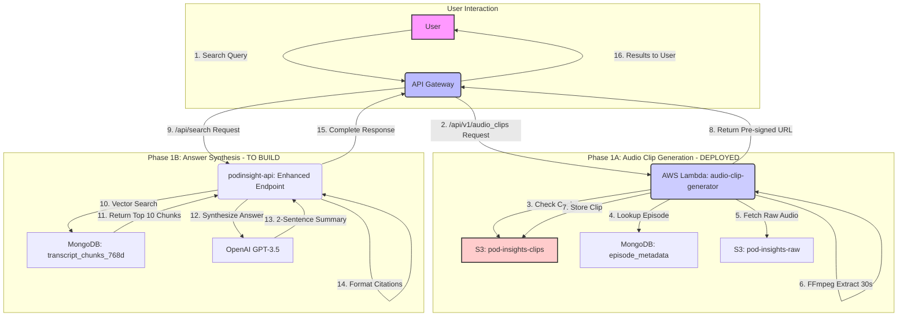

# Sprint 3 Architecture Documentation - Command Bar Features

## Overview
This document serves as the single source of truth for PodInsightHQ's Sprint 3 features, encompassing the on-demand audio clip generation system (Phase 1A - deployed) and the answer synthesis pipeline (Phase 1B - to be implemented).

## Key Architectural Decisions
- **On-demand Audio Generation**: Saves $10K/year by avoiding 60-80% duplicate clips
- **Lambda for Audio Processing**: Keeps main API lightweight and scalable
- **30-second Clips**: Centered on chunk timestamps for optimal context
- **10-chunk Context Window**: ~1000 tokens for comprehensive answer synthesis

## Complete System Architecture

### 1. Data Flow Diagram



### 2. MongoDB Schema

#### Collection: `episode_metadata`
```json
{
  "_id": ObjectId,
  "guid": "string",           // Primary key used by Lambda
  "episode_id": "string",     // Legacy identifier
  "podcast_name": "string",
  "episode_title": "string",
  "published_date": Date,
  "duration_seconds": number,
  "s3_audio_path": "string",  // Full S3 path to raw audio
  "transcript_status": "string",
  "created_at": Date,
  "updated_at": Date
}
```

#### Collection: `transcript_chunks_768d`
```json
{
  "_id": ObjectId,
  "episode_id": "string",     // Links to episode_metadata.guid
  "chunk_index": number,      // Sequential order within episode
  "text": "string",          // Transcript segment (~100 tokens)
  "start_time": number,      // Start time in seconds
  "end_time": number,        // End time in seconds
  "embedding_768d": [        // 768-dimensional vector
    number, number, ..., number
  ],
  "created_at": Date
}
```

#### Collection: `podcast_metadata`
```json
{
  "_id": ObjectId,
  "feed_slug": "string",     // e.g., "a16z-podcast"
  "podcast_name": "string",  // Display name
  "category": "string",
  "total_episodes": number,
  "updated_at": Date
}
```

### 3. S3 Bucket Structure

#### Bucket: `pod-insights-raw` (Existing)
```
s3://pod-insights-raw/
├── <feed_slug>/
│   └── <episode_guid>/
│       └── audio/
│           └── <original_filename>.mp3
```
Example: `s3://pod-insights-raw/a16z-podcast/0e983347-7815-4b62-87a6-84d988a772b7/audio/episode_audio.mp3`

#### Bucket: `pod-insights-clips` (Created by CloudFormation)
```
s3://pod-insights-clips/
└── audio_clips/
    └── <episode_guid>/
        └── <start_ms>-<end_ms>.mp3
```
Example: `s3://pod-insights-clips/audio_clips/0e983347-7815-4b62-87a6-84d988a772b7/30000-60000.mp3`

### 4. API Specifications

#### Audio Clip Endpoint (Phase 1A - DEPLOYED)

**Lambda API Gateway**: `https://39wfiyyk92.execute-api.eu-west-2.amazonaws.com/prod`

```http
GET /api/v1/audio_clips/{episode_id}?start_time_ms={start}&duration_ms=30000

Response 200:
{
  "clip_url": "https://pod-insights-clips.s3.eu-west-2.amazonaws.com/...",
  "cache_hit": true,
  "generation_time_ms": 0
}

Response 404:
{
  "error": "Episode not found"
}
```

#### Enhanced Search Endpoint (Phase 1B - TO BUILD)

```http
POST /api/search
{
  "query": "What are VCs saying about AI valuations?",
  "limit": 10
}

Response 200:
{
  "answer": "VCs express concern that AI agent valuations are outpacing actual capital efficiency¹². Recent rounds show 50-100x revenue multiples despite unclear moats².",
  "citations": [
    {
      "index": 1,
      "episode_id": "0e983347-7815-4b62-87a6-84d988a772b7",
      "episode_title": "AI Bubble or Breakthrough?",
      "podcast_name": "a16z Podcast",
      "timestamp": "27:04",
      "start_seconds": 1624,
      "chunk_index": 45,
      "text": "The valuations we're seeing in AI agents..."
    }
  ],
  "raw_chunks": [...],
  "processing_time_ms": 2150
}
```

### 5. Infrastructure Details

#### AWS Lambda Function (Phase 1A)
- **Name**: `audio-clip-generator`
- **Runtime**: Python 3.9
- **Memory**: 1GB
- **Timeout**: 60 seconds
- **Layers**:
  - `ffmpeg-podinsight` (custom layer, 58MB)
- **Environment Variables**:
  ```
  MONGODB_URI=mongodb+srv://...
  S3_SOURCE_BUCKET=pod-insights-raw
  S3_CLIPS_BUCKET=pod-insights-clips
  AWS_REGION=eu-west-2
  ```

#### Performance Metrics (Production)
- **Cache Hit**: <200ms (direct S3 URL return)
- **Cache Miss**: 1128ms (includes FFmpeg processing)
- **Cold Start**: ~1650ms
- **Memory Usage**: 94MB of 1GB allocated

### 6. Answer Synthesis Pipeline (Phase 1B)

#### MongoDB Aggregation Pipeline
```javascript
[
  // 1. Vector Search with improved recall
  {
    $vectorSearch: {
      index: "vector_index_768d",
      path: "embedding_768d",
      queryVector: embedding,
      numCandidates: 100,    // Increased from 20
      limit: 20
    }
  },

  // 2. Join with episode metadata
  {
    $lookup: {
      from: "episode_metadata",
      localField: "episode_id",
      foreignField: "guid",
      as: "episode"
    }
  },

  // 3. Diversity - Max 2 chunks per episode
  {
    $group: {
      _id: "$episode_id",
      chunks: { $push: "$$ROOT" },
      max_score: { $max: "$score" }
    }
  },
  { $unwind: { path: "$chunks", includeArrayIndex: "rank" } },
  { $match: { rank: { $lt: 2 } } },

  // 4. Final selection - top 10 for LLM
  { $sort: { "chunks.score": -1 } },
  { $limit: 10 }
]
```

#### OpenAI Integration
```python
SYSTEM_PROMPT = """
You are a podcast intelligence assistant. Given search results,
provide a 2-sentence synthesis (max 60 words) that directly
answers the question. Cite sources with superscript numbers ¹².

Rules:
- Be specific and actionable
- Use exact quotes when impactful
- Require ≥2 distinct episodes as sources
"""

# Model: gpt-3.5-turbo-0125
# Temperature: 0
# Max tokens: 80
```

### 7. Frontend Integration (Phase 2)

The command bar will make sequential API calls:
1. **Search**: `POST /api/search` → Get answer + citations
2. **Audio** (on-demand): When user clicks play:
   - Frontend calls: `GET /api/v1/audio_clips/{episode_id}?start_time_ms={start}`
   - Shows loading spinner (2-3s on first play)
   - Plays 30-second clip inline

### 8. Cost Analysis

| Component | Usage/Month | Cost | Notes |
|-----------|-------------|------|-------|
| OpenAI GPT-3.5 | 1,000 queries | $18 | ~1000 tokens per query |
| Lambda Execution | 500 clips | $5 | Includes cold starts |
| S3 Storage | 10GB growing | $2 | Only popular clips stored |
| S3 Requests | 10,000 | $1 | GET/PUT operations |
| **Total** | | **$26/month** | vs $833/month pre-generated |

### 9. Security & Access

- **MongoDB**: IP whitelist includes Lambda (0.0.0.0/0 required)
- **S3 Buckets**:
  - `pod-insights-raw`: Private, Lambda IAM role access
  - `pod-insights-clips`: Private, pre-signed URLs for access
- **API Gateway**: Public endpoint with future rate limiting
- **Lambda IAM Role**: S3 read/write, CloudWatch logs

### 10. Monitoring & Observability

- **CloudWatch Logs**: All Lambda executions logged
- **Metrics to Track**:
  - Audio generation success rate (target: >95%)
  - Cache hit rate (target: >80% after 7 days)
  - Generation time p95 (target: <3s)
  - OpenAI response time (target: <2s)

## Implementation Status

### ✅ Completed (Phase 1A)
- Lambda function deployed and operational
- FFmpeg layer configured
- S3 buckets created
- MongoDB connection established
- API Gateway endpoint live
- Performance validated in production

### 🔲 To Implement (Phase 1B & 2)
- [ ] Enhance /api/search with OpenAI integration
- [ ] Citation extraction and formatting
- [ ] Frontend command bar component
- [ ] Audio player with loading states
- [ ] Integration testing end-to-end

## Critical Notes

1. **Audio Clip Timing**: Clips are generated as `[start_time - 15s, start_time + 15s]` to center on the chunk
2. **Citation Matching**: Use chunk_index to match OpenAI citations back to source chunks
3. **Error Handling**: Both Lambda and API must handle gracefully:
   - Missing episodes
   - S3 access failures
   - OpenAI timeouts
   - Invalid timestamps

---

*Last Updated: December 28, 2024*
*Status: Phase 1A Complete, Phase 1B Ready to Implement*
